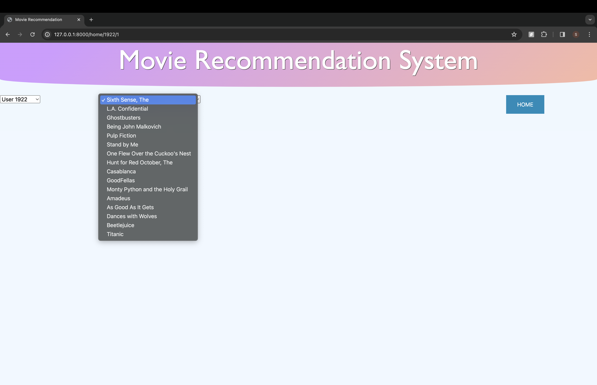

# Movielens+KG Graph Visualization UI
User Interface for movie recommendations. 

## Demo
1. Home Page just displays some of the users and movies watched by those users in a graph format. Yellow nodes are users, Blue nodes are movies
    
2. Once the user is selected from the leftmost dropdown, all the movies recommended to that user will be shown in the 2nd dropdown
    
3. By selecting each movie, a fun interactive graph will be displayed explaining why this particular movie is recommended to that user on a high level
    
4. Blue node is the user, Yellow node is the recommended movie, Green nodes are some of the movies watched and rated by that user. 
5. Red nodes are some of the common attributes of recommended movie and movies watched by the user, which are factored in while generating recommendations 
    
    

## Requirements
* Python 3.7
* graphviz
    ```
    brew install graphviz
    ```
    Make sure that graphviz executables are in your system's PATH environment variable
* pydot
* matplotlib
* Django
    ```
    pip install django
    ```

## How to run
1. Clone the repo or download as .zip and extract.
2. Then run the following in a terminal - 
    ```
    cd <project-directory>
    python manage.py runserver 0.0.0.0:8000
    ```
3. Then, in a browser visit http://127.0.0.1:8000


### For changing title.
  * File: movie_recommendations_app\templates\base.html
  * Line: 17 
 ```
<title>Movie Recommendation</title>
 ```
 
 ### For changing header title.
 * File: movie_recommendations_app\templates\base.html
 * Line: 84 
 ```
    <h1>Movie Recommendation System</h1>
```

### CSS Locations.
* File: movie_recommendations_app\templates\base.html
* Home button : Lines 56-65
* Graph division : Lines 67-69
* Users dropdown : Lines 71-73
* Recommendations dropdown : Lines 75-77
* Header layout : Lines 29-54
* Body Layout : 23-26

### To manage graph size.
1. Main Graph
    * File: movie_recommendations_file\templates\base.html
    * Lines: 165-166
        ```
        width:"100%",
        height:"700",
        ```
    * Lines: 164-196 (To manage options of whole graph like nodes, size, physics etc)
2. User,Rec Graph
    * File: movie_recommendations_app\templates\graph.html
    * Lines: 110-111
        ```
        width:"100%",
        height:"700",
        ```
    * Lines: 109-141 (To manage options of whole graph like nodes, size, physics etc)

### Users,ratings,movies json files.
* Location: movie_recommendations_app\data\ (filename.json)
* Update with the same file names :
    1. recommendations.json
    2. attribute_explanation.json
    3. history.json
    4. item_mapping.json
* Used in file: movie_recommendations_app\views.py
* Lines: 19-21
```
file_path1 = os.path.join(DIR,'data', 'recommendations.json')
file_path2 = os.path.join(DIR,'data','item_mapping.json')
file_path3 = os.path.join(DIR,'data','attribute_explanation.json')
```

### Main graph's json file.
* Location: movie_recommendations_app\full_kg.json
* Update json file here with same name 
* Used in file: movie_recommendations_app\views.py
* Line: 107
```
    fp2 = os.path.join(DIR,'full_kg.json')
```

### User,Rec graphs' json files.
* Location: cache\ (filename.json)
* Used in file: movie_recommendations_app\views.py
* Lines: 180-181
```
    k = str(user) + "_item-" + str(rec) + ".json"
    check = os.path.join("cache", f"kgr_graph_user-user_{k}")
```
